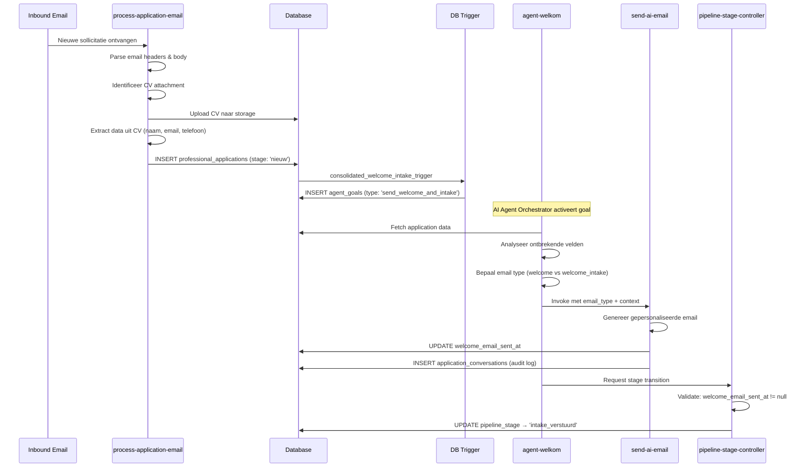
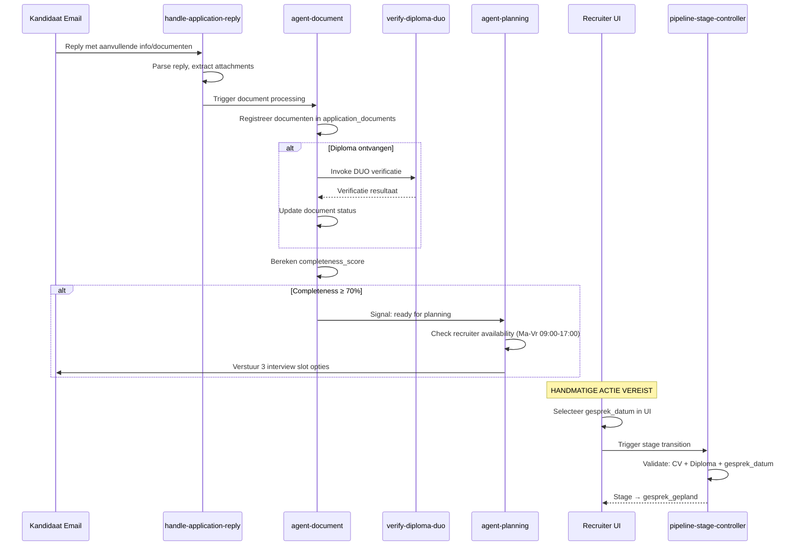
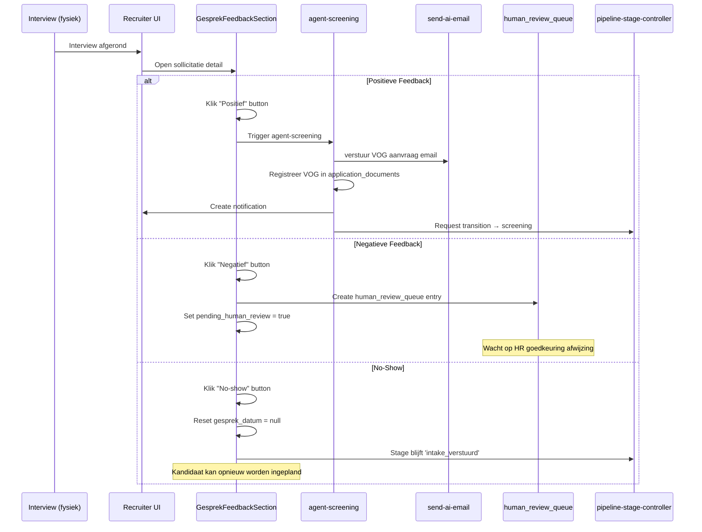
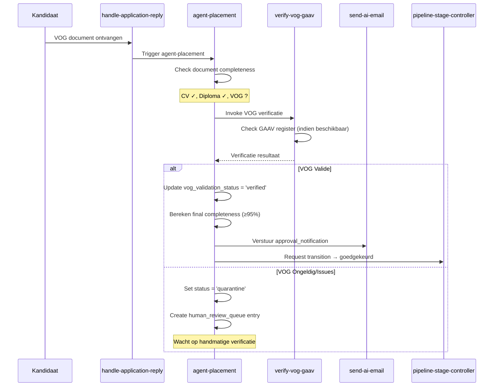
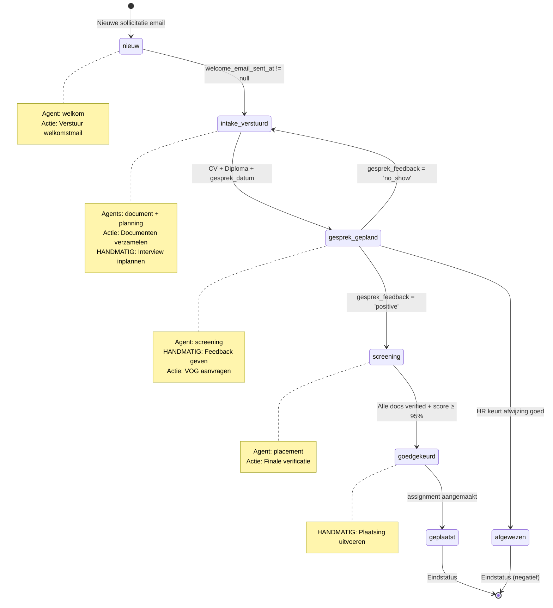

# Agent Workflow Per Pipeline Stage

> **Versie:** 1.0.0  
> **Laatste update:** 2025-01-18  
> **Status:** Production

Dit document beschrijft de volledige AI Agent workflow voor elke pipeline stage in het recruitment systeem van CitoZorg/ABCzorg.

---

## Inhoudsopgave

1. [Pipeline Overzicht](#pipeline-overzicht)
2. [Agent Specialist Mapping](#agent-specialist-mapping)
3. [Stage: NIEUW](#stage-nieuw)
4. [Stage: INTAKE_VERSTUURD](#stage-intake_verstuurd)
5. [Stage: GESPREK_GEPLAND](#stage-gesprek_gepland)
6. [Stage: SCREENING](#stage-screening)
7. [Stage: GOEDGEKEURD](#stage-goedgekeurd)
8. [Stage: GEPLAATST](#stage-geplaatst)
9. [Handmatige Acties Overzicht](#handmatige-acties-overzicht)
10. [Database Triggers & System Events](#database-triggers--system-events)
11. [Email Template Mapping](#email-template-mapping)
12. [Transitie Diagram](#transitie-diagram)

---

## Pipeline Overzicht

```
┌─────────┐    ┌──────────────────┐    ┌─────────────────┐    ┌────────────┐    ┌─────────────┐    ┌───────────┐
│  NIEUW  │ → │ INTAKE_VERSTUURD │ → │ GESPREK_GEPLAND │ → │ SCREENING  │ → │ GOEDGEKEURD │ → │ GEPLAATST │
└─────────┘    └──────────────────┘    └─────────────────┘    └────────────┘    └─────────────┘    └───────────┘
     ↓                  ↓                      ↓                    ↓                 ↓                  ↓
  agent-           agent-document         agent-              agent-            Handmatig          Eindstatus
  welkom           agent-planning         screening           placement
```

### Stage Definities

| Stage | Doel | Verantwoordelijke |
|-------|------|-------------------|
| `nieuw` | Welkomstmail versturen, eerste contact | AI Agent (welkom) |
| `intake_verstuurd` | Documenten verzamelen, interview voorstellen | AI Agent (document + planning) |
| `gesprek_gepland` | Interview afwachten, feedback verwerken | Recruiter + AI Agent (screening) |
| `screening` | Finale verificatie, VOG controle | AI Agent (placement) |
| `goedgekeurd` | Kandidaat gereed voor plaatsing | Recruiter (handmatig) |
| `geplaatst` | Kandidaat actief bij klant | Recruiter (handmatig) |

---

## Agent Specialist Mapping

| Stage | Agent Specialist | Edge Function | System Prompt Versie |
|-------|-----------------|---------------|---------------------|
| `nieuw` | welkom | `agent-welkom/index.ts` | v1.0.0 |
| `intake_verstuurd` | document | `agent-document/index.ts` | v1.0.0 |
| `intake_verstuurd` | planning | `agent-planning/index.ts` | v1.0.0 |
| `gesprek_gepland` | screening | `agent-screening/index.ts` | v1.0.0 |
| `screening` | placement | `agent-placement/index.ts` | v1.0.0 |

### Agent Configuratie in Database

```sql
SELECT agent_name, handles_stage, target_stage, email_types, available_tools
FROM agent_specialists
WHERE is_active = true;
```

---

## Stage: NIEUW

### Overzicht

| Eigenschap | Waarde |
|------------|--------|
| **Verantwoordelijke Agent** | `agent-welkom` |
| **Trigger** | Nieuwe sollicitatie email ontvangen |
| **Doel** | Kandidaat welkom heten, ontbrekende informatie identificeren |
| **Target Stage** | `intake_verstuurd` |

### Workflow Stappen



### Stap-voor-Stap Beschrijving

#### Stap 1: Email Ontvangst
- **Component:** `process-application-email/index.ts`
- **Actie:** Resend webhook ontvangt nieuwe email op `inbound.citozorg.nl`
- **Validatie:** Svix signature verificatie

#### Stap 2: Email Parsing
- **Component:** `process-application-email/index.ts`
- **Actie:** 
  - Parse `from`, `to`, `subject`, `body`
  - Identificeer bijlagen (CV, diploma)
  - Check voor reply headers (`Re:`, `Antw:`, `in_reply_to`)

#### Stap 3: CV Upload & Extractie
- **Component:** `process-application-email/index.ts`
- **Actie:**
  - Upload CV naar Supabase Storage (`application-documents` bucket)
  - Invoke `extract-cv-data` voor data extractie
  - Vul `extracted_data` JSON met:
    - `naam` (kandidaat naam)
    - `email` (kandidaat email)
    - `telefoonnummer` (indien gevonden)
    - `functie_niveau` (bijv. "Niveau 3", "Niveau 4")
    - `ervaring_sector` (bijv. "GGZ", "VVT")

#### Stap 4: Application Record Aanmaken
- **Component:** `process-application-email/index.ts`
- **Database:** `professional_applications`
- **Velden:**
  ```sql
  INSERT INTO professional_applications (
    org_id,
    email_from,
    email_subject,
    email_body,
    cv_file_path,
    extracted_data,
    pipeline_stage,  -- 'nieuw'
    status,          -- 'new'
    created_at
  )
  ```

#### Stap 5: Database Trigger Activatie
- **Trigger:** `consolidated_welcome_intake_trigger`
- **Conditie:** `NEW.pipeline_stage = 'nieuw'`
- **Actie:** Creëert `agent_goal` record:
  ```sql
  INSERT INTO agent_goals (
    org_id,
    goal_type,           -- 'send_welcome_and_intake'
    goal_description,    -- 'Verstuur welkomstmail naar [naam]'
    status,              -- 'pending'
    priority,            -- 2 (high)
    input_data           -- { application_id, candidate_name, etc. }
  )
  ```

#### Stap 6: Agent Welkom Activatie
- **Component:** `agent-welkom/index.ts`
- **Trigger:** AI Agent Orchestrator pakt pending goal op
- **Acties:**
  1. Fetch volledige application data
  2. Analyseer `extracted_data` voor ontbrekende velden
  3. Bepaal email type:
     - `welcome`: Alleen welkom (alle info compleet)
     - `welcome_intake`: Welkom + vraag om ontbrekende info

#### Stap 7: Missing Info Analyse
- **Component:** `agent-welkom/index.ts`
- **Controleert:**
  | Veld | Bron | Vereist |
  |------|------|---------|
  | Naam | `extracted_data.naam` | ✓ |
  | Email | `email_from` | ✓ |
  | Telefoon | `extracted_data.telefoonnummer` | ○ |
  | Functieniveau | `extracted_data.functie_niveau` | ○ |
  | Werkvorm | `extracted_data.werkvorm` | ○ |
  | Beschikbaarheid | `extracted_data.beschikbaarheid` | ○ |

- **Output:** `fields_to_ask[]` array met ontbrekende velden

#### Stap 8: Email Versturen
- **Component:** `send-ai-email/index.ts`
- **Input:**
  ```json
  {
    "email_type": "welcome_intake",
    "application_id": "uuid",
    "recipient_email": "kandidaat@email.nl",
    "recipient_name": "Jan Jansen",
    "fields_to_ask": ["telefoonnummer", "beschikbaarheid"]
  }
  ```
- **Output:**
  - Gepersonaliseerde email verstuurd via Resend
  - `welcome_email_sent_at` timestamp gezet
  - Audit log in `application_conversations`

#### Stap 9: Stage Transitie
- **Component:** `pipeline-stage-controller/index.ts`
- **Validatie:**
  ```javascript
  const canTransition = application.welcome_email_sent_at !== null;
  ```
- **Actie:** `UPDATE pipeline_stage = 'intake_verstuurd'`

### Transitie Vereisten

| Vereiste | Type | Beschrijving |
|----------|------|--------------|
| `welcome_email_sent_at` | Timestamp | Moet gezet zijn (niet null) |

### Email Types

| Email Type | Wanneer | Template Inhoud |
|------------|---------|-----------------|
| `welcome` | Alle basisinfo aanwezig | Welkomstbericht, bevestiging ontvangst sollicitatie |
| `welcome_intake` | Info ontbreekt | Welkomstbericht + verzoek om aanvullende informatie |

### Beschikbare Tools

| Tool | Beschrijving |
|------|--------------|
| `send_email` | Verstuur email via Resend |
| `query_application` | Ophalen application data |

### Wat Agent NIET Doet in Deze Stage

- ❌ Document verificatie (DUO/diploma check)
- ❌ Interview plannen
- ❌ VOG aanvragen
- ❌ Stage direct updaten (gaat via pipeline-stage-controller)

---

## Stage: INTAKE_VERSTUURD

### Overzicht

| Eigenschap | Waarde |
|------------|--------|
| **Verantwoordelijke Agents** | `agent-document` + `agent-planning` |
| **Trigger** | Kandidaat reageert op welkomstmail |
| **Doel** | Documenten verzamelen, interview voorstellen |
| **Target Stage** | `gesprek_gepland` |

### Twee Parallelle Agents

#### Agent Document

| Eigenschap | Waarde |
|------------|--------|
| **Focus** | Documenten verzamelen en verifiëren |
| **Email Types** | `followup_question`, `document_request`, `documents_received_confirmation` |
| **Tools** | `send_email`, `trigger_document_verification`, `register_document`, `query_documents` |

#### Agent Planning

| Eigenschap | Waarde |
|------------|--------|
| **Focus** | Interview slots voorstellen |
| **Email Types** | `interview_slot_proposal` |
| **Tools** | `check_recruiter_availability`, `send_email`, `create_notification` |
| **Voorwaarde** | Pas actief wanneer documenten voldoende compleet zijn |

### Workflow Stappen



### Agent Document - Stap-voor-Stap

#### Stap 1: Reply Ontvangst
- **Component:** `handle-application-reply/index.ts`
- **Trigger:** Kandidaat reageert op email
- **Detectie:** Headers `Re:`, `Antw:`, `in_reply_to`, `references`

#### Stap 2: Data Extractie uit Reply
- **Component:** `handle-application-reply/index.ts`
- **Acties:**
  - Parse email body voor nieuwe informatie
  - Identificeer attachments (diploma, ID, etc.)
  - Update `extracted_data` met nieuwe velden

#### Stap 3: Document Registratie
- **Component:** `agent-document/index.ts`
- **Database:** `application_documents`
- **Velden:**
  ```sql
  INSERT INTO application_documents (
    application_id,
    document_type,    -- 'cv', 'diploma', 'vog', 'id_document'
    filename,
    file_path,
    is_verified,      -- false (initieel)
    source,           -- 'email_attachment'
    created_at
  )
  ```

#### Stap 4: Diploma Verificatie
- **Component:** `verify-diploma-duo/index.ts`
- **Trigger:** Diploma document ontvangen
- **Verificatie Cascade:**
  1. Primary: Browserless HTTP API (Puppeteer)
  2. Fallback: PDF signature analyse (PKCS7/CMS)
- **Output:** `diploma_verified_at`, `diploma_verification_status`

#### Stap 5: Completeness Score Berekening
- **Component:** `agent-document/index.ts`
- **Formule:**
  ```javascript
  const score = calculateCompleteness({
    naam: !!extractedData.naam,           // 15%
    email: !!application.email_from,      // 15%
    telefoon: !!extractedData.telefoonnummer, // 10%
    cv: hasCV,                            // 20%
    diploma: hasDiploma,                  // 20%
    diploma_verified: diplomaVerified,    // 10%
    functie_niveau: !!extractedData.functie_niveau, // 5%
    beschikbaarheid: !!extractedData.beschikbaarheid // 5%
  });
  ```

#### Stap 6: Follow-up Emails
- **Component:** `agent-document/index.ts`
- **Wanneer:** Documenten ontbreken
- **Email Types:**
  | Type | Wanneer |
  |------|---------|
  | `document_request` | Specifiek document ontbreekt |
  | `followup_question` | Informatie velden ontbreken |
  | `documents_received_confirmation` | Alle documenten ontvangen |

### Agent Planning - Stap-voor-Stap

#### Stap 1: Activatie Voorwaarden
- **Checks:**
  - CV aanwezig in `application_documents`
  - Diploma aanwezig in `application_documents`
  - `completeness_score >= 70`

#### Stap 2: Beschikbaarheid Check
- **Component:** `agent-planning/index.ts`
- **Tool:** `check_recruiter_availability`
- **Query:**
  ```sql
  SELECT available_slots FROM tasks
  WHERE type = 'recruiter_availability'
  AND slot_date BETWEEN NOW() AND NOW() + INTERVAL '14 days'
  AND slot_time BETWEEN '09:00' AND '17:00'
  AND day_of_week IN (1,2,3,4,5)  -- Ma-Vr
  LIMIT 3;
  ```

#### Stap 3: Slot Voorstel Email
- **Component:** `agent-planning/index.ts`
- **Email Type:** `interview_slot_proposal`
- **Template Variabelen:**
  ```json
  {
    "candidate_name": "Jan Jansen",
    "slot_1": "Maandag 20 jan om 10:00",
    "slot_2": "Dinsdag 21 jan om 14:00",
    "slot_3": "Woensdag 22 jan om 11:00"
  }
  ```

### Transitie Vereisten (naar `gesprek_gepland`)

| Vereiste | Type | Beschrijving |
|----------|------|--------------|
| CV | Document | Aanwezig in `application_documents` |
| Diploma | Document | Aanwezig in `application_documents` |
| `diploma_verified` | Boolean | Diploma is geverifieerd via DUO |
| `completeness_score` | Number | ≥ 70 |
| `gesprek_datum` | Timestamp | **HANDMATIG** ingevuld door recruiter |

### ⚠️ HANDMATIGE ACTIE VEREIST

```
┌─────────────────────────────────────────────────────────┐
│  RECRUITER ACTIE: Gesprek Inplannen                     │
│                                                         │
│  Locatie: ApplicationDetailModal > GesprekFeedbackSection │
│                                                         │
│  Actie:                                                 │
│  1. Open sollicitatie detail                            │
│  2. Ga naar "Interview" tab                             │
│  3. Selecteer datum in DatePicker                       │
│  4. Klik "Interview Inplannen"                          │
│                                                         │
│  Effect:                                                │
│  - gesprek_datum wordt gezet                            │
│  - pipeline_stage → 'gesprek_gepland'                   │
│  - gesprek_feedback → 'pending'                         │
└─────────────────────────────────────────────────────────┘
```

### Wat Agents NIET Doen in Deze Stage

- ❌ Automatisch interview inplannen (is handmatig)
- ❌ VOG aanvragen (pas na positieve feedback)
- ❌ Stage updaten zonder recruiter actie

---

## Stage: GESPREK_GEPLAND

### Overzicht

| Eigenschap | Waarde |
|------------|--------|
| **Verantwoordelijke Agent** | `agent-screening` |
| **Trigger** | Recruiter geeft feedback na interview |
| **Doel** | Interview feedback verwerken, VOG aanvragen bij succes |
| **Target Stage** | `screening` |

### Workflow Stappen



### Stap-voor-Stap per Feedback Type

#### Positieve Feedback

1. **Recruiter Actie:** Klik "Positief" in `GesprekFeedbackSection`
2. **Database Updates:**
   ```sql
   UPDATE professional_applications
   SET gesprek_feedback = 'positive',
       updated_at = NOW()
   WHERE id = :application_id;
   ```
3. **Agent Screening Activatie:**
   - Creëert goal: `request_vog`
   - Verstuurt VOG aanvraag email
4. **Document Registratie:**
   ```sql
   INSERT INTO application_documents (
     application_id,
     document_type,   -- 'vog'
     is_verified,     -- false
     source,          -- 'agent_request'
     created_at
   )
   ```
5. **Stage Transitie:** `gesprek_gepland` → `screening`

#### Negatieve Feedback

1. **Recruiter Actie:** Klik "Negatief" in `GesprekFeedbackSection`
2. **Database Updates:**
   ```sql
   UPDATE professional_applications
   SET gesprek_feedback = 'negative',
       pending_human_review = true,
       updated_at = NOW()
   WHERE id = :application_id;
   ```
3. **Human Review Queue:**
   ```sql
   INSERT INTO human_review_queue (
     application_id,
     review_type,         -- 'rejection_approval'
     escalation_reason,   -- 'Negative interview feedback requires HR approval'
     status,              -- 'pending'
     priority,            -- 1 (high)
     created_at
   )
   ```
4. **Stage:** Blijft `gesprek_gepland` tot HR besluit

#### No-Show

1. **Recruiter Actie:** Klik "No-show" in `GesprekFeedbackSection`
2. **Database Updates:**
   ```sql
   UPDATE professional_applications
   SET gesprek_feedback = 'no_show',
       gesprek_datum = NULL,
       updated_at = NOW()
   WHERE id = :application_id;
   ```
3. **Stage Transitie:** `gesprek_gepland` → `intake_verstuurd` (voor herplanning)

### Email Types

| Email Type | Wanneer | Template Inhoud |
|------------|---------|-----------------|
| `vog_request` | Positieve feedback | Verzoek om VOG aan te leveren |
| `status_update` | Feedback verwerkt | Status update naar kandidaat |

### Beschikbare Tools

| Tool | Beschrijving |
|------|--------------|
| `send_email` | Verstuur email via Resend |
| `request_vog` | Registreer VOG aanvraag |
| `record_interview_feedback` | Log feedback in audit trail |

### Transitie Vereisten (naar `screening`)

| Vereiste | Type | Beschrijving |
|----------|------|--------------|
| `gesprek_feedback` | Enum | Moet `'positive'` zijn |

### ⚠️ HANDMATIGE ACTIE VEREIST

```
┌─────────────────────────────────────────────────────────┐
│  RECRUITER ACTIE: Interview Feedback Geven              │
│                                                         │
│  Locatie: ApplicationDetailModal > GesprekFeedbackSection │
│                                                         │
│  Opties:                                                │
│  ✓ Positief  → VOG aanvraag, door naar screening        │
│  ✗ Negatief  → Human review queue, wacht op HR          │
│  ○ No-show   → Reset datum, terug naar intake_verstuurd │
│                                                         │
│  LET OP: Negatieve feedback vereist HR goedkeuring!     │
└─────────────────────────────────────────────────────────┘
```

---

## Stage: SCREENING

### Overzicht

| Eigenschap | Waarde |
|------------|--------|
| **Verantwoordelijke Agent** | `agent-placement` |
| **Trigger** | VOG ontvangen of verificatie update |
| **Doel** | Finale documentcontrole, goedkeuring versturen |
| **Target Stage** | `goedgekeurd` |

### Workflow Stappen



### Stap-voor-Stap

#### Stap 1: VOG Ontvangst
- **Component:** `handle-application-reply/index.ts`
- **Actie:** VOG attachment gedetecteerd en geüpload

#### Stap 2: Agent Placement Activatie
- **Component:** `agent-placement/index.ts`
- **Trigger:** Document update in `application_documents`

#### Stap 3: Document Completeness Check
- **Controleert:**
  | Document | Status | Vereist |
  |----------|--------|---------|
  | CV | Aanwezig | ✓ |
  | Diploma | Aanwezig + Geverifieerd | ✓ |
  | VOG | Aanwezig + Geverifieerd | ✓ |

#### Stap 4: VOG Verificatie
- **Component:** `verify-vog-gaav/index.ts`
- **Checks:**
  - Document authenticiteit
  - Datum geldigheid (VOG max 3 maanden oud)
  - Naam match met kandidaat
- **Output:**
  ```sql
  UPDATE application_documents
  SET is_verified = true,
      verified_at = NOW(),
      metadata = jsonb_set(metadata, '{vog_validation_status}', '"verified"')
  WHERE application_id = :id AND document_type = 'vog';
  ```

#### Stap 5: Final Completeness Check
- **Minimum Score:** 95%
- **Vereiste Documenten:** CV, Diploma (verified), VOG (verified)

#### Stap 6: Goedkeuring Email
- **Email Type:** `approval_notification`
- **Template Inhoud:**
  - Bevestiging screening afgerond
  - Volgende stappen (wachten op plaatsing)

### Transitie Vereisten (naar `goedgekeurd`)

| Vereiste | Type | Beschrijving |
|----------|------|--------------|
| CV | Document | Aanwezig |
| Diploma | Document | Aanwezig + `is_verified = true` |
| VOG | Document | Aanwezig + `is_verified = true` |
| `completeness_score` | Number | ≥ 95 |

### Email Types

| Email Type | Wanneer | Template Inhoud |
|------------|---------|-----------------|
| `approval_notification` | Screening voltooid | Bevestiging goedkeuring |

### Beschikbare Tools

| Tool | Beschrijving |
|------|--------------|
| `send_email` | Verstuur email via Resend |
| `verify_vog` | Invoke VOG verificatie |

---

## Stage: GOEDGEKEURD

### Overzicht

| Eigenschap | Waarde |
|------------|--------|
| **Verantwoordelijke** | Recruiter (handmatig) |
| **Status** | Kandidaat volledig gescreend en goedgekeurd |
| **Volgende Stap** | Plaatsing bij klant |

### Geen Automatische Agent

Deze stage heeft **geen** automatische agent. De recruiter moet handmatig:

1. **Professional Record Aanmaken**
   - Via UI of automatische trigger bij goedkeuring
   - Kopieert data van `professional_applications` naar `professionals`

2. **Matching Starten**
   - Zoek geschikte klant/locatie
   - Gebruik matching algoritme in UI

3. **Plaatsing Initiëren**
   - Selecteer sublocation
   - Vul plaatsingsdetails in
   - Creëer `assignments` record

### Transitie Vereisten (naar `geplaatst`)

| Vereiste | Type | Beschrijving |
|----------|------|--------------|
| `professional_id` | UUID | Professional record moet bestaan |
| `assignment_id` | UUID | Assignment record moet bestaan |

### ⚠️ HANDMATIGE ACTIE VEREIST

```
┌─────────────────────────────────────────────────────────┐
│  RECRUITER ACTIE: Plaatsing Uitvoeren                   │
│                                                         │
│  Stappen:                                               │
│  1. Open Professionals pagina                           │
│  2. Zoek geschikte klant via Matching Panel             │
│  3. Selecteer sublocation                               │
│  4. Vul plaatsingsdetails in:                           │
│     - Startdatum                                        │
│     - Uren per week                                     │
│     - Werkvorm (ZZP/Uitzend)                            │
│  5. Bevestig plaatsing                                  │
│                                                         │
│  Effect:                                                │
│  - assignments record aangemaakt                        │
│  - pipeline_stage → 'geplaatst'                         │
└─────────────────────────────────────────────────────────┘
```

---

## Stage: GEPLAATST

### Overzicht

| Eigenschap | Waarde |
|------------|--------|
| **Status** | Eindstatus |
| **Betekenis** | Kandidaat actief werkzaam bij klant |

### Eindstatus

Dit is de **finale stage** van het recruitment proces. De kandidaat:

- Is volledig gescreend (CV, Diploma, VOG geverifieerd)
- Heeft positieve interview feedback
- Is gekoppeld aan een klant via `assignments` tabel
- Is nu een actieve `professional`

### Geen Verdere Automatische Acties

Na plaatsing zijn er geen automatische agent acties meer in het recruitment pipeline. Wel kunnen er:

- Evaluatie verzoeken worden verstuurd (apart proces)
- Document verlengingen worden gemonitord (VOG expiry)
- Plaatsing verlengingen worden beheerd

---

## Handmatige Acties Overzicht

| Stage | Actie | Wie | Locatie in UI |
|-------|-------|-----|---------------|
| `intake_verstuurd` | Interview inplannen | Recruiter | `GesprekFeedbackSection` |
| `gesprek_gepland` | Feedback geven | Recruiter | `GesprekFeedbackSection` |
| `gesprek_gepland` | Afwijzing goedkeuren | HR | `HumanReviewQueue` |
| `goedgekeurd` | Plaatsing uitvoeren | Recruiter | `Professionals` + `Matching Panel` |

---

## Database Triggers & System Events

### Triggers die Agent Goals Aanmaken

| Trigger Naam | Tabel | Conditie | Goal Type |
|--------------|-------|----------|-----------|
| `consolidated_welcome_intake_trigger` | `professional_applications` | `NEW.pipeline_stage = 'nieuw'` | `send_welcome_and_intake` |
| `document_upload_trigger` | `application_documents` | `NEW.document_type IN ('diploma')` | `verify_diploma` |
| `positive_feedback_trigger` | `professional_applications` | `NEW.gesprek_feedback = 'positive'` | `request_vog` |
| `vog_upload_trigger` | `application_documents` | `NEW.document_type = 'vog'` | `verify_vog` |

### System Events Flow

```sql
-- Voorbeeld: Nieuwe sollicitatie trigger flow
INSERT INTO system_events (
  event_type,        -- 'application.created'
  source,            -- 'process-application-email'
  payload,           -- { application_id, ... }
  processed_at
) VALUES (...);

-- Dit triggert de agent orchestrator
INSERT INTO agent_goals (
  goal_type,
  status,            -- 'pending'
  input_data
) VALUES (...);
```

---

## Email Template Mapping

| Email Type | Stage(s) | Agent | Template ID |
|------------|----------|-------|-------------|
| `welcome` | nieuw | welkom | `tpl_welcome_basic` |
| `welcome_intake` | nieuw | welkom | `tpl_welcome_with_questions` |
| `followup_question` | intake_verstuurd | document | `tpl_followup_info` |
| `document_request` | intake_verstuurd | document | `tpl_document_request` |
| `documents_received_confirmation` | intake_verstuurd | document | `tpl_docs_received` |
| `interview_slot_proposal` | intake_verstuurd | planning | `tpl_interview_slots` |
| `vog_request` | gesprek_gepland | screening | `tpl_vog_request` |
| `status_update` | gesprek_gepland | screening | `tpl_status_update` |
| `approval_notification` | screening | placement | `tpl_approval` |

---

## Transitie Diagram



---

## Appendix: Agent Specialist Database Schema

```sql
CREATE TABLE agent_specialists (
    id UUID PRIMARY KEY DEFAULT gen_random_uuid(),
    agent_name TEXT NOT NULL,           -- 'welkom', 'document', 'planning', etc.
    handles_stage TEXT NOT NULL,         -- 'nieuw', 'intake_verstuurd', etc.
    target_stage TEXT NOT NULL,          -- Stage waar agent naartoe werkt
    email_types TEXT[] DEFAULT '{}',     -- Toegestane email templates
    available_tools TEXT[] DEFAULT '{}', -- Beschikbare tools voor agent
    system_prompt TEXT,                  -- Agent-specifieke instructies
    transition_requirements JSONB,       -- Vereisten voor stage transitie
    requires_human_approval BOOLEAN DEFAULT false,
    is_active BOOLEAN DEFAULT true,
    version TEXT DEFAULT '1.0.0',
    created_at TIMESTAMPTZ DEFAULT NOW(),
    updated_at TIMESTAMPTZ DEFAULT NOW()
);
```

---

## Changelog

| Versie | Datum | Wijzigingen |
|--------|-------|-------------|
| 1.0.0 | 2025-01-18 | Initiële documentatie |
