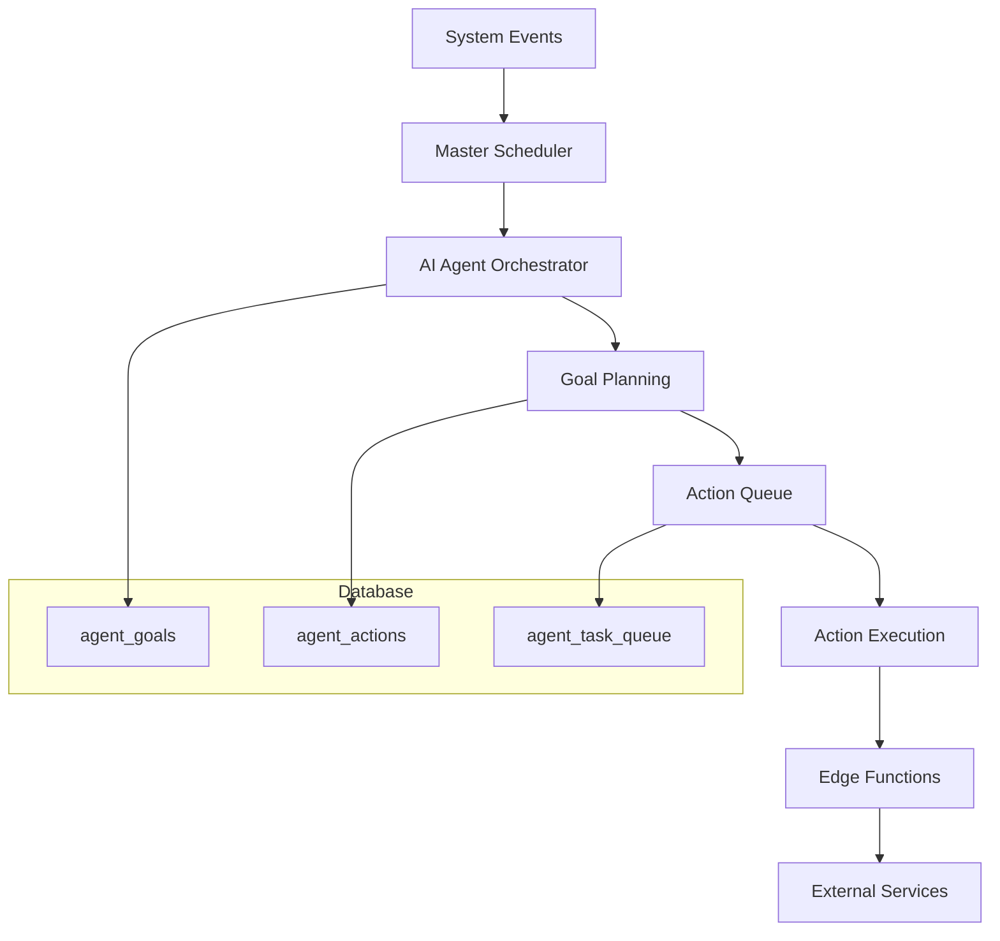
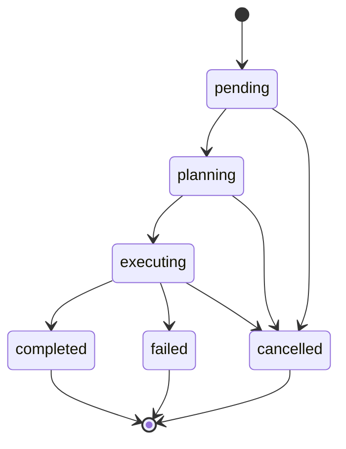

# AI Agent Goal Types - Enterprise Documentatie

> **Versie:** 2.0.0-enterprise  
> **Laatst bijgewerkt:** 2026-01-04  
> **Eigenaar:** AI Systems Team ABCzorg/CitoZorg

Dit document definieert alle AI Agent goal types die binnen het recruitment systeem worden gebruikt. Het dient als referentie voor ontwikkelaars en als configuratiegids voor het AI Agent Orchestrator systeem.

---

## Inhoudsopgave

1. [Architectuur Overzicht](#1-architectuur-overzicht)
2. [Goal Lifecycle](#2-goal-lifecycle)
3. [Goal Type Definities](#3-goal-type-definities)
4. [Action Types](#4-action-types)
5. [Prioriteit & Scheduling](#5-prioriteit--scheduling)
6. [Error Handling](#6-error-handling)
7. [Monitoring & Metrics](#7-monitoring--metrics)

---

## 1. Architectuur Overzicht

### 1.1 Systeemcomponenten



### 1.2 Execution Flow

1. **Event Trigger**: System event of handmatige trigger
2. **Goal Creation**: Nieuw doel in `agent_goals` tabel
3. **Planning Phase**: AI genereert action plan
4. **Queue Population**: Actions naar `agent_task_queue`
5. **Execution**: Orchestrator voert actions uit
6. **Completion**: Goal status update naar `completed`

---

## 2. Goal Lifecycle

### 2.1 Goal Statuses

| Status | Beschrijving | Volgende Status |
|--------|--------------|-----------------|
| `pending` | Nieuw aangemaakt, wacht op planning | `planning` |
| `planning` | AI genereert action plan | `executing` |
| `executing` | Actions worden uitgevoerd | `completed` / `failed` |
| `completed` | Succesvol afgerond | - |
| `failed` | Gefaald na max retries | - |
| `cancelled` | Handmatig geannuleerd | - |

### 2.2 Status Transitions



---

## 3. Goal Type Definities

### 3.1 Application Intake Goals

#### `send_welcome_and_intake`

**Doel**: Verstuur welkomstmail en intake vragen naar nieuwe kandidaat.

| Eigenschap | Waarde |
|------------|--------|
| **Trigger** | Nieuwe applicatie aangemaakt |
| **Prioriteit** | 10 (hoogste) |
| **Input Data** | `{ application_id, email, naam }` |
| **Output Actions** | `send_welcome_email`, `send_intake_questions` |
| **Success Criteria** | Email succesvol verzonden |

```typescript
// Voorbeeld input_data
{
  "application_id": "uuid",
  "candidate_email": "email@example.com",
  "candidate_name": "Jan de Vries",
  "org_id": "550e8400-e29b-41d4-a716-446655440000"
}
```

---

#### `application_intake_completion`

**Doel**: Verzamel ontbrekende informatie van kandidaat.

| Eigenschap | Waarde |
|------------|--------|
| **Trigger** | Missing info > 0 na initiële intake |
| **Prioriteit** | 8 |
| **Input Data** | `{ application_id, missing_info[], attempt_count }` |
| **Output Actions** | `send_followup_question` |
| **Max Attempts** | 5 |
| **Cooldown** | 24 uur tussen attempts |

```typescript
// Voorbeeld input_data
{
  "application_id": "uuid",
  "missing_info": ["telefoonnummer", "regio", "beschikbaarheid"],
  "attempt_count": 1,
  "previous_attempts": []
}
```

---

#### `send_reply_response`

**Doel**: Verwerk kandidaat email reply en genereer intelligent antwoord.

| Eigenschap | Waarde |
|------------|--------|
| **Trigger** | Inkomende email via Resend webhook |
| **Prioriteit** | 9 |
| **Input Data** | `{ application_id, email_content, response_type }` |
| **Output Actions** | `analyze_reply`, `update_application`, `send_response` |
| **Response Types** | `acceptance`, `rejection`, `question`, `info_provided` |

---

### 3.2 Professional Creation Goals

#### `professional_document_collection`

**Doel**: Verzamel ontbrekende documenten voor nieuwe professional.

| Eigenschap | Waarde |
|------------|--------|
| **Trigger** | Professional aangemaakt met `beschikbaar_pending_documents` status |
| **Prioriteit** | 8 |
| **Input Data** | `{ professional_id, application_id, missing_docs[] }` |
| **Output Actions** | `send_document_request` |
| **Success Criteria** | Alle documenten ontvangen en geverifieerd |

```typescript
// Voorbeeld input_data
{
  "professional_id": "uuid",
  "application_id": "uuid",
  "missing_docs": ["vog", "diploma"],
  "professional_email": "email@example.com"
}
```

---

### 3.3 Interview Scheduling Goals

#### `schedule_interview`

**Doel**: Plan interview met kandidaat.

| Eigenschap | Waarde |
|------------|--------|
| **Trigger** | Completeness ≥ 85% |
| **Prioriteit** | 9 |
| **Input Data** | `{ application_id, candidate_email, preferred_slots[] }` |
| **Output Actions** | `send_interview_slots`, `wait_for_response`, `create_calendar_event` |
| **Slot Generation** | Automatisch op basis van recruiter agenda |

```typescript
// Voorbeeld input_data
{
  "application_id": "uuid",
  "candidate_email": "email@example.com",
  "candidate_name": "Jan de Vries",
  "interview_type": "intake_gesprek",
  "duration_minutes": 45
}
```

---

#### `interview_slot_rejected`

**Doel**: Genereer alternatieve interview slots na afwijzing.

| Eigenschap | Waarde |
|------------|--------|
| **Trigger** | Kandidaat wijst voorgestelde slots af |
| **Prioriteit** | 8 |
| **Input Data** | `{ application_id, rejected_slots[], attempt_count }` |
| **Max Attempts** | 2 |
| **Output Actions** | `generate_alternative_slots`, `send_new_slots` |

---

### 3.4 Matching Goals

#### `calculate_matches`

**Doel**: Bereken matches tussen kandidaat en client sublocations.

| Eigenschap | Waarde |
|------------|--------|
| **Trigger** | Completeness ≥ 50% of profile update |
| **Prioriteit** | 6 |
| **Input Data** | `{ application_id, functie_niveau, regio, werkvorm }` |
| **Output Actions** | `calculate_sublocation_scores`, `store_matches` |

---

### 3.5 Document Verification Goals

#### `verify_vog`

**Doel**: Verifieer VOG document via GAAV API.

| Eigenschap | Waarde |
|------------|--------|
| **Trigger** | VOG document geüpload |
| **Prioriteit** | 7 |
| **Input Data** | `{ application_id, document_path }` |
| **Output Actions** | `gaav_api_check`, `update_verification_status` |

---

#### `verify_diploma`

**Doel**: Verifieer diploma via EMREX/DUO.

| Eigenschap | Waarde |
|------------|--------|
| **Trigger** | Diploma document geüpload |
| **Prioriteit** | 7 |
| **Input Data** | `{ application_id, document_path, claimed_niveau }` |
| **Output Actions** | `emrex_verification`, `update_verification_status` |

---

## 4. Action Types

### 4.1 Email Actions

| Action Type | Beschrijving | Edge Function |
|-------------|--------------|---------------|
| `send_welcome_email` | Welkomstmail | `send-ai-email` |
| `send_followup_question` | Follow-up vragen | `generate-followup-email` → `send-ai-email` |
| `send_interview_slots` | Interview uitnodiging | `send-interview-email` |
| `send_document_request` | Document verzoek | `send-ai-email` |
| `send_reminder` | Herinnering | `send-reminder-email` |
| `send_general_email` | Algemene email | `send-ai-email` |

### 4.2 Calendar Actions

| Action Type | Beschrijving | Integration |
|-------------|--------------|-------------|
| `create_calendar_event` | Calendar event aanmaken | n8n → Microsoft Outlook |
| `update_calendar_event` | Event wijzigen | n8n → Microsoft Outlook |
| `cancel_calendar_event` | Event annuleren | n8n → Microsoft Outlook |

### 4.3 Data Actions

| Action Type | Beschrijving | Edge Function |
|-------------|--------------|---------------|
| `update_application` | Application data bijwerken | Direct database |
| `calculate_matches` | Match scores berekenen | `calculate-application-matches` |
| `create_professional` | Professional record aanmaken | `create-professional-from-application` |

### 4.4 Verification Actions

| Action Type | Beschrijving | Edge Function |
|-------------|--------------|---------------|
| `verify_vog_gaav` | VOG verificatie | `verify-vog-gaav` |
| `verify_diploma_emrex` | Diploma verificatie | `verify-diploma-emrex` |
| `verify_kvk` | KvK verificatie | `firecrawl-scrape` (Browserless) |

---

## 5. Prioriteit & Scheduling

### 5.1 Prioriteit Levels

| Prioriteit | Bereik | Beschrijving | Voorbeelden |
|------------|--------|--------------|-------------|
| **Kritiek** | 10 | Onmiddellijke actie vereist | Welkomstmail |
| **Hoog** | 8-9 | Binnen 1 uur | Interview scheduling, document collection |
| **Medium** | 5-7 | Binnen 4 uur | Matching, verificatie |
| **Laag** | 1-4 | Best effort | Analytics, cleanup |

### 5.2 Scheduling Regels

```typescript
const SCHEDULING_RULES = {
  // Cooldown periodes
  followup_cooldown_hours: 24,
  interview_reminder_hours: 24,
  document_reminder_days: 3,
  
  // Max attempts
  max_followup_attempts: 5,
  max_interview_slot_attempts: 2,
  max_document_request_attempts: 3,
  
  // Batch sizes
  goals_per_cycle: 10,
  actions_per_goal: 5
};
```

### 5.3 Cron Schedule

| Component | Schedule | Beschrijving |
|-----------|----------|--------------|
| `master-scheduler` | `*/5 * * * *` | Elke 5 minuten |
| `process-system-events` | Via master-scheduler | Event processing |
| `ai-agent-orchestrator` | Via master-scheduler | Goal execution |

---

## 6. Error Handling

### 6.1 Retry Strategy

```typescript
const RETRY_CONFIG = {
  max_retries: 3,
  initial_delay_ms: 1000,
  backoff_multiplier: 2,
  max_delay_ms: 30000
};
```

### 6.2 Error Categories

| Category | Beschrijving | Actie |
|----------|--------------|-------|
| `transient` | Tijdelijke fout (netwerk, rate limit) | Retry met backoff |
| `permanent` | Onherstelbare fout | Mark as failed |
| `validation` | Input validatie fout | Log en skip |
| `external_service` | Externe service fout | Retry of fallback |

### 6.3 Circuit Breaker

Externe services hebben circuit breaker protectie:

```typescript
const CIRCUIT_BREAKER = {
  failure_threshold: 5,
  reset_timeout_ms: 60000,
  half_open_requests: 3
};
```

---

## 7. Monitoring & Metrics

### 7.1 Key Metrics

| Metric | Beschrijving | Target |
|--------|--------------|--------|
| `goal_completion_rate` | % succesvol afgeronde goals | > 95% |
| `avg_goal_duration_ms` | Gemiddelde uitvoeringstijd | < 30000 |
| `action_success_rate` | % succesvolle actions | > 98% |
| `queue_depth` | Aantal wachtende actions | < 100 |

### 7.2 Alerting Thresholds

| Alert | Conditie | Severity |
|-------|----------|----------|
| `high_failure_rate` | failure_rate > 10% in 1 uur | Critical |
| `queue_backlog` | queue_depth > 500 | Warning |
| `slow_execution` | avg_duration > 60s | Warning |
| `circuit_open` | Elke circuit breaker open | Critical |

### 7.3 Dashboard Queries

```sql
-- Actieve goals per type
SELECT goal_type, status, COUNT(*) 
FROM agent_goals 
WHERE created_at > now() - interval '24 hours'
GROUP BY goal_type, status;

-- Gemiddelde uitvoeringstijd per goal type
SELECT goal_type, 
       AVG(EXTRACT(EPOCH FROM (completed_at - started_at))) as avg_seconds
FROM agent_goals 
WHERE status = 'completed'
GROUP BY goal_type;

-- Failed actions met error messages
SELECT action_type, error_message, COUNT(*)
FROM agent_actions
WHERE status = 'failed'
  AND created_at > now() - interval '24 hours'
GROUP BY action_type, error_message;
```

---

## Changelog

| Versie | Datum | Wijziging |
|--------|-------|-----------|
| 2.0.0-enterprise | 2026-01-04 | Complete enterprise documentatie |
| 1.0.0 | 2025-12-15 | Initiële versie |

---

*Dit document wordt onderhouden door het AI Systems Team en is onderdeel van de technische documentatie.*
