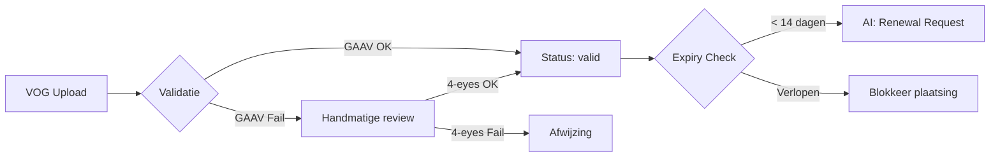
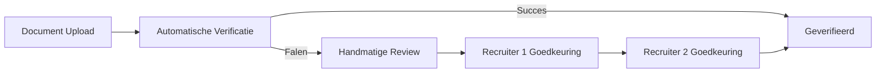

# HR Compliance Standards - Enterprise Niveau

> **Versie:** 2.0.0-enterprise  
> **Laatst bijgewerkt:** 2026-01-04  
> **Eigenaar:** HR Compliance Team ABCzorg/CitoZorg

Dit document definieert alle HR compliance standaarden voor ABCzorg en CitoZorg. Het dient als **Single Source of Truth** voor alle HR-gerelateerde validatie, documentvereisten en pipeline compliance gates.

---

## Inhoudsopgave

1. [VOG Compliance Lifecycle](#1-vog-compliance-lifecycle)
2. [Diploma & Certificaat Validatie](#2-diploma--certificaat-validatie)
3. [Werkvorm Classificatie](#3-werkvorm-classificatie)
4. [ZZP Documentvereisten Matrix](#4-zzp-documentvereisten-matrix)
5. [Functieniveau Mapping](#5-functieniveau-mapping)
6. [Pipeline Stage Compliance Gates](#6-pipeline-stage-compliance-gates)
7. [Completeness Score Berekening](#7-completeness-score-berekening)
8. [Document Verificatie Protocollen](#8-document-verificatie-protocollen)
9. [Bureau Classificatie](#9-bureau-classificatie)

---

## 1. VOG Compliance Lifecycle

### 1.1 Validiteit Regels

| Regel | Waarde | Toelichting |
|-------|--------|-------------|
| **Maximum geldigheid** | 3 maanden | Vanaf afgiftedatum VOG |
| **Waarschuwingsperiode** | 14 dagen | Trigger voor vernieuwingsverzoek |
| **Grace period** | 0 dagen | Geen tolerantie na expiry |

### 1.2 Expiry Statuses

```typescript
type VogExpiryStatus = 'valid' | 'expiring_soon' | 'expired' | 'missing';
```

| Status | Conditie | Actie |
|--------|----------|-------|
| `valid` | VOG < 3 maanden oud | Geen actie nodig |
| `expiring_soon` | VOG verloopt binnen 14 dagen | AI Agent triggert hernieuwingsverzoek |
| `expired` | VOG > 3 maanden oud | Blokkeert plaatsing, document collection goal |
| `missing` | Geen VOG aanwezig | Blokkeert plaatsing, document collection goal |

### 1.3 Verificatie Methoden

| Methode | Prioriteit | Beschrijving | Betrouwbaarheid |
|---------|------------|--------------|-----------------|
| **GAAV API** | 1 (primair) | Digitale handtekening validatie via overheids-API | 99% |
| **PDF Metadata** | 2 (fallback) | Datum extractie uit document properties | 85% |
| **Handmatige verificatie** | 3 (laatste redmiddel) | 4-eyes principe: 2 recruiters | 95% |

### 1.4 Automatische Acties



---

## 2. Diploma & Certificaat Validatie

### 2.1 Erkende Zorgdiploma's

| Diploma | Code | BIG-registratie | Niveau |
|---------|------|-----------------|--------|
| Helpende | Helpende 2 | Nee | MBO-2 |
| Verzorgende Niveau 3 | VP3 | Nee | MBO-3 |
| Verzorgende Niveau 4 | VP4 | Nee | MBO-4 |
| Verzorgende IG | VIG | Ja (optioneel) | MBO-4+ |
| Verpleegkundige MBO | Verpleegkundige MBO | Ja | MBO-4 |
| Verpleegkundige HBO | HBO-V | Ja | HBO |
| Begeleider | Begeleider | Nee | MBO-3/4 |
| Persoonlijk Begeleider | Persoonlijk begeleider | Nee | MBO-4 |
| GGZ-agoog | GGZ-agoog | Nee | HBO |

### 2.2 Verificatie Methoden

| Methode | Prioriteit | Beschrijving |
|---------|------------|--------------|
| **EMREX/DUO** | 1 (primair) | Directe verificatie via DUO registratie |
| **BIG-register** | 2 | Automatische check voor BIG-beroepen |
| **Handmatige verificatie** | 3 | 4-eyes principe bij fallback |

### 2.3 BIG-Registratie Lifecycle

| Aspect | Waarde |
|--------|--------|
| Geldigheid | 5 jaar |
| Herregistratie | Verplicht voor behoud beroepstitel |
| Automatische check | Dagelijks via BIG-register API |

---

## 3. Werkvorm Classificatie

### 3.1 Geldige Werkvormen

| Werkvorm | Database Value | Beschrijving |
|----------|----------------|--------------|
| **ZZP** | `ZZP` | Zelfstandige zonder personeel |
| **Uitzendkracht** | `Uitzendkracht` | Via uitzendbureau (loondienst) |
| **ABCito constructie** | `ABCito constructie` | Hybride constructie |

### 3.2 Normalisatie Mappings

```typescript
const WERKVORM_MAP = {
  'zzp': 'ZZP',
  'zzper': 'ZZP',
  "zzp'er": 'ZZP',
  'freelance': 'ZZP',
  'freelancer': 'ZZP',
  'zelfstandig': 'ZZP',
  'uitzend': 'Uitzendkracht',
  'uitzendkracht': 'Uitzendkracht',
  'uitzendwerk': 'Uitzendkracht',
  'payroll': 'Uitzendkracht',
  'abcito': 'ABCito constructie',
};
```

### 3.3 Financiële Implicaties

| Werkvorm | Berekening | Componenten |
|----------|------------|-------------|
| **ZZP** | Uurtarief × uren | Uurtarief + ORT-toeslagen |
| **Uitzendkracht** | Salarisschaal + werkgeverslasten | Bruto salaris + ~40% lasten |
| **ABCito** | Hybride | Afhankelijk van contract |

---

## 4. ZZP Documentvereisten Matrix

### 4.1 Verplichte Documenten (ZZP)

| Document | Veld | Expiry | Verificatie |
|----------|------|--------|-------------|
| **KvK Uittreksel** | `kvk_uittreksel_path` | 3 maanden | Browserless scraping |
| **IBAN Zakelijk** | `iban` | Geen | NL-format check |
| **Bedrijfsnaam** | `bedrijfsnaam` | Geen | KvK match |
| **Beroepsaansprakelijkheid** | `beroepsaansprakelijkheid_path` | 12 maanden | PDF aanwezig |
| **Klachtenportaal WKKGZ** | `klachtenportaal_wkkgz_path` | Geen | Registratie check |
| **Identiteitsbewijs** | `identiteitsbewijs_path` | Paspoort/ID geldigheid | PDF aanwezig |

### 4.2 Optionele Documenten (ZZP)

| Document | Veld | Expiry | Toelichting |
|----------|------|--------|-------------|
| **BHV Certificaat** | `bhv_certificaat_path` | 24 maanden | Aanbevolen |
| **Tillift Certificaat** | `tillift_certificaat_path` | 24 maanden | Bij fysieke zorg |

### 4.3 Standaard Documenten (Alle Werkvormen)

| Document | Veld | Expiry | Verplicht |
|----------|------|--------|-----------|
| **VOG** | `vog_path` | 3 maanden | Ja |
| **Diploma** | `diploma_path` | Geen | Ja |
| **CV** | `cv_path` | Geen | Ja |

---

## 5. Functieniveau Mapping

### 5.1 Normalisatie Tabel

| Input Variatie | Database Value |
|----------------|----------------|
| verzorgende ig, VIG, v.i.g, v.i.g. | `VIG` |
| verzorgende niveau 3, verzorgende 3, niveau 3 | `VP3` |
| verzorgende niveau 4, verzorgende 4, niveau 4 | `VP4` |
| hbo verpleegkundige, hbo-v, hbov, hbo v | `HBO-V` |
| helpende, helpende 2, helpende niveau 2 | `Helpende 2` |
| verpleegkundige mbo, mbo verpleegkundige | `Verpleegkundige MBO` |
| begeleider | `Begeleider` |
| persoonlijk begeleider | `Persoonlijk begeleider` |
| ggz-agoog, ggz agoog | `GGZ-agoog` |

### 5.2 Hiërarchie

```
HBO-V (hoogst)
  ↓
Verpleegkundige MBO / VIG
  ↓
VP4
  ↓
VP3 / Begeleider / Persoonlijk begeleider / GGZ-agoog
  ↓
Helpende 2 (laagst)
```

---

## 6. Pipeline Stage Compliance Gates

### 6.1 Stage Definities

| Stage | Beschrijving | Minimum Completeness |
|-------|--------------|---------------------|
| `nieuw` | Net binnengekomen | 0% |
| `intake_verstuurd` | Intake vragen verzonden | 20% |
| `screening` | Eerste beoordeling | 30% |
| `interview` | Gesprek gepland/uitgevoerd | 70% |
| `goedgekeurd` | Akkoord voor professional creatie | 85% |
| `geplaatst` | Actief bij klant | 95% |
| `afgewezen` | Niet geschikt | N/A |
| `on_hold` | Tijdelijk gepauzeerd | N/A |

### 6.2 Compliance Gates per Stage

```typescript
const STAGE_COMPLIANCE_GATES = {
  'nieuw': {
    minCompleteness: 0,
    requiredDocs: [],
    requiredFields: ['naam', 'email']
  },
  'intake_verstuurd': {
    minCompleteness: 20,
    requiredDocs: [],
    requiredFields: ['naam', 'email']
  },
  'screening': {
    minCompleteness: 30,
    requiredDocs: [],
    requiredFields: ['naam', 'email', 'functie_niveau', 'werkvorm']
  },
  'interview': {
    minCompleteness: 70,
    requiredDocs: ['cv'],
    requiredFields: ['naam', 'email', 'functie_niveau', 'werkvorm', 'regio', 'telefoonnummer']
  },
  'goedgekeurd': {
    minCompleteness: 85,
    requiredDocs: ['cv', 'diploma'],
    requiredFields: ['naam', 'email', 'functie_niveau', 'werkvorm', 'regio', 'telefoonnummer', 'beschikbaarheid']
  },
  'geplaatst': {
    minCompleteness: 95,
    requiredDocs: ['cv', 'diploma', 'vog'],
    requiredFields: ['naam', 'email', 'functie_niveau', 'werkvorm', 'regio', 'telefoonnummer', 'beschikbaarheid', 'diploma']
  }
};
```

### 6.3 Stage Transitie Regels

| Van | Naar | Vereisten |
|-----|------|-----------|
| `nieuw` | `intake_verstuurd` | Automatisch bij eerste contact |
| `intake_verstuurd` | `screening` | Completeness ≥ 30% |
| `screening` | `interview` | Completeness ≥ 70%, CV aanwezig |
| `interview` | `goedgekeurd` | Recruiter goedkeuring |
| `goedgekeurd` | `geplaatst` | VOG valid, Diploma geverifieerd |

---

## 7. Completeness Score Berekening

### 7.1 Kritieke Velden (Basis)

| Veld | Gewicht | Verplicht |
|------|---------|-----------|
| `naam` | 15% | Ja |
| `email` | 15% | Ja |
| `functie_niveau` | 15% | Ja |
| `werkvorm` | 10% | Ja |
| `regio` | 10% | Ja |
| `beschikbaarheid` | 10% | Ja |
| `telefoonnummer` | 10% | Ja |
| `diploma` | 15% | Ja |

### 7.2 ZZP-Specifieke Velden

Wanneer `werkvorm = 'ZZP'`, worden extra velden toegevoegd:

| Veld | Gewicht | Verplicht |
|------|---------|-----------|
| `iban` | 8% | Ja |
| `bedrijfsnaam` | 8% | Ja |
| `beroepsaansprakelijkheid_path` | 8% | Ja |
| `kvk_uittreksel_path` | 8% | Ja |
| `klachtenportaal_wkkgz_path` | 8% | Ja |
| `identiteitsbewijs_path` | 8% | Ja |

### 7.3 Berekening Formule

```typescript
function calculateHRCompletenessScore(data: Record<string, unknown>): number {
  const baseFields = CRITICAL_FIELDS;
  const zzpFields = data.werkvorm === 'ZZP' ? ZZP_REQUIRED_FIELDS : [];
  
  const allFields = [...baseFields, ...zzpFields];
  const filledFields = allFields.filter(f => hasValidValue(data, f));
  
  return Math.round((filledFields.length / allFields.length) * 100);
}
```

---

## 8. Document Verificatie Protocollen

### 8.1 4-Eyes Principe

Voor handmatige document verificatie is altijd een tweede goedkeuring vereist:



### 8.2 Verificatie Database Schema

```sql
CREATE TABLE verification_approvals (
  id UUID PRIMARY KEY,
  document_id UUID REFERENCES application_documents(id),
  approved_by UUID REFERENCES auth.users(id),
  approved_at TIMESTAMPTZ DEFAULT now(),
  approval_type TEXT, -- 'first_approval' | 'second_approval'
  notes TEXT
);
```

### 8.3 Fraud Mitigatie Lagen

| Laag | Beschrijving | Effectiviteit |
|------|--------------|---------------|
| 1. GAAV API | VOG digitale handtekening | ~99% |
| 2. PDF Metadata | Datum uit document, niet filename | ~90% |
| 3. 3-maanden regel | Automatische expiry check | ~100% |
| 4. EMREX/DUO | Directe diploma verificatie | ~99% |
| 5. 4-eyes | Dubbele menselijke goedkeuring | ~95% |

---

## 9. Bureau Classificatie

### 9.1 Permanente Toewijzing

| Bureau | Org ID | Klantorganisaties |
|--------|--------|-------------------|
| **ABCzorg** | `550e8400-e29b-41d4-a716-446655440000` | Amarant, 's Heeren Loo, Pluryn, Pro Persona, Leger des Heils |
| **CitoZorg** | `650e8400-e29b-41d4-a716-446655440001` | Stichting SWZ, Stichting Prisma, Lunet zorg, Stichting Fokus/Siza |

### 9.2 Classificatie Regels

- Elke klantorganisatie is **permanent** toegewezen aan één bureau
- Geen splitting of dual assignment toegestaan
- Professionals kunnen **niet** cross-bureau worden geplaatst
- Billing/payment routing volgt bureau-toewijzing

---

## Changelog

| Versie | Datum | Wijziging |
|--------|-------|-----------|
| 2.0.0-enterprise | 2026-01-04 | Complete enterprise documentatie |
| 1.0.0 | 2025-12-01 | Initiële versie |

---

*Dit document wordt onderhouden door het HR Compliance Team en is onderdeel van de AI Agent kennisbank.*
